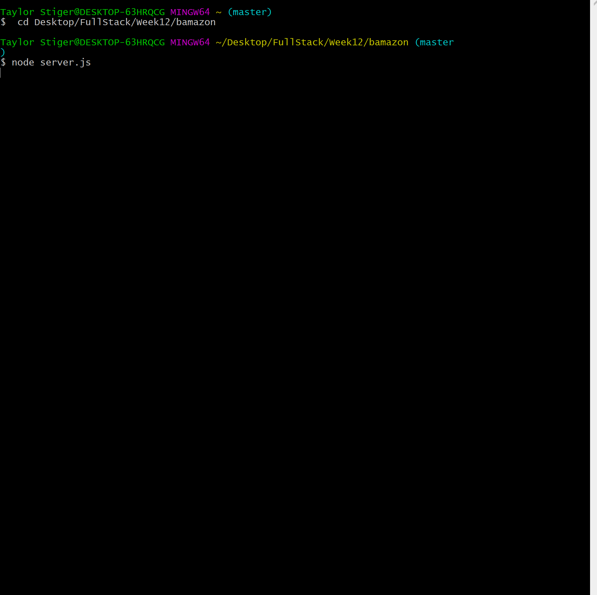

# bamazon
Week 12  "Bamazon" MySQL Project

* Customer Instructions
* When the serverjs is run it wil initally show the customer various products to choose from.
 

* Then it will ask them the ID of the product they would like to buy.
* The second message should ask how many units of the product they would like to buy.
   * If not, the app log a phrase `Insufficient quantity!`, and then prevent the order from going through.
   * If the store _does_ have enough of the product, it will fulfill the customer's order.
   * This means updating the SQL database to reflect the remaining quantity.
   * Once the update goes through, it shows the customer the total cost of their purchase.
 
